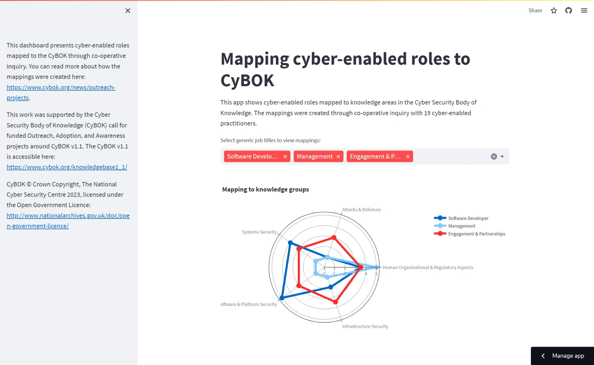

# cybok-maps-coinquiry[^1]

This app shows cyber-enabled roles mapped to knowledge areas in the Cyber Security Body of Knowledge. The mappings were created through co-operative inquiry with 19 cyber-enabled practitioners.

[^1]: This work is/was supported by the Cyber Security Body of Knowledge (CyBOK) call for funded Outreach, Adoption, and Awareness projects around CyBOK v1.1. CyBOK © Crown Copyright, The National Cyber Security Centre 2023, licensed under the Open Government Licence http://www.nationalarchives.gov.uk/doc/open-government-licence/.
